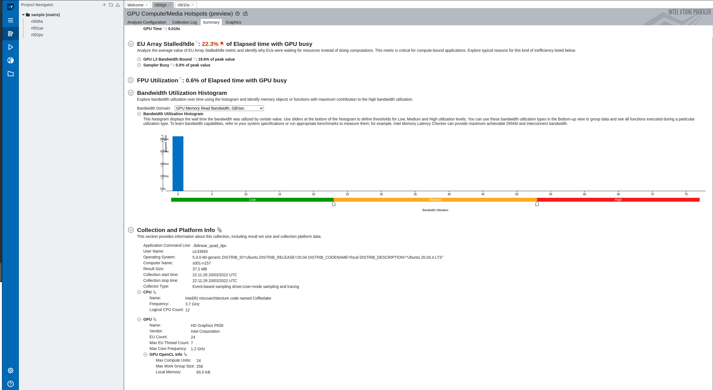
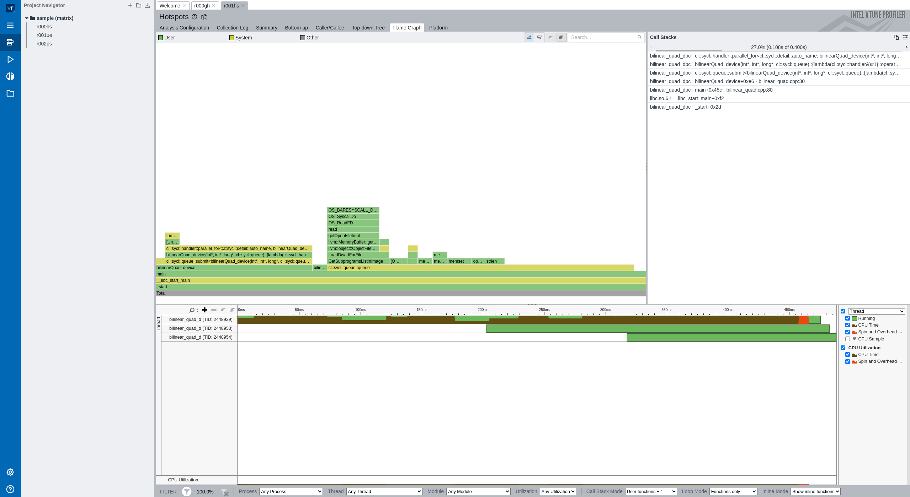

# GSoC_Athena

## Exercise 1
Setting up the DPC++ compiler, compiling and running the vector addition and matrix multiplication examples.

oneapi setup: 

```
[konradd-Flow@fedora vector-add]$ source /opt/software/intel/oneapi/setvars.sh 
 
:: initializing oneAPI environment ...
   bash: BASH_VERSION = 5.1.8(1)-release
   args: Using "$@" for setvars.sh arguments: 
:: advisor -- latest
:: ccl -- latest
:: compiler -- latest
:: debugger -- latest
:: dev-utilities -- latest
:: dpcpp-ct -- latest
:: dpl -- latest
:: ipp -- latest
:: ippcp -- latest
:: ipp -- latest
:: mkl -- latest
:: mpi -- latest
:: tbb -- latest
:: vpl -- latest
:: vtune -- latest
:: oneAPI environment initialized ::
```
vector addition: 

```
[konradd-Flow@fedora vector-add]$ make all
dpcpp -O2 -g -std=c++17 -o vector-add-buffers src/vector-add-buffers.cpp
[konradd-Flow@fedora vector-add]$ ls
License.txt    Makefile.win.fpga  third-party-programs.txt    vector-add-usm.vcxproj
Makefile       README.md          vector-add-buffers
Makefile.fpga  sample.json        vector-add-buffers.vcxproj
Makefile.win   src                vector-add.sln
[konradd-Flow@fedora vector-add]$ ./vector-add-buffers 
Running on device: AMD Ryzen 7 5800HS with Radeon Graphics         
Vector size: 10000
[0]: 0 + 0 = 0
[1]: 1 + 1 = 2
[2]: 2 + 2 = 4
...
[9999]: 9999 + 9999 = 19998
Vector add successfully completed on device.
```

Matrix multiplication:

```
[konradd-Flow@fedora matrix_mul]$ make all
dpcpp -std=c++17 -g -o matrix_mul_dpc src/matrix_mul_dpcpp.cpp 
[konradd-Flow@fedora matrix_mul]$ ls
License.txt  Makefile.win    matrix_mul_dpcpp.vcxproj  README.md    src
Makefile     matrix_mul_dpc  matrix_mul.sln            sample.json  third-party-programs.txt
[konradd-Flow@fedora matrix_mul]$ ./matrix_mul_dpc 
Device: AMD Ryzen 7 5800HS with Radeon Graphics         
Problem size: c(150,600) = a(150,300) * b(300,600)
Result of matrix multiplication using DPC++: Success - The results are correct!
```

## Exercise 2

Since I have a local access only to an AMD Ryzen cpu and a NVIDIA graphics card, I will compare running the code on those two, using Intel's open source [llvm compiler](https://github.com/intel/llvm) for NVIDIA card.

 - Matrix multiplication with `m_size = 1500 * 8` using `cpu_selector{}`:

 ```
[konradd-Flow@fedora matrix_mul]$ multitime ./matrix_mul_dpc
Device: AMD Ryzen 7 5800HS with Radeon Graphics         
Problem size: c(1500,6000) = a(1500,3000) * b(3000,6000)
Result of matrix multiplication using DPC++: Success - The results are correct!
===> multitime results
1: ./matrix_mul_dpc
            Mean        Std.Dev.    Min         Median      Max
real        49.812      0.000       49.812      49.812      49.812      
user        70.243      0.000       70.243      70.243      70.243      
sys         0.250       0.000       0.250       0.250       0.250
```

- Compiling and running the same code for NVIDIA card using `gpu_selector{}`:

```
[konradd-Flow@fedora matrix_mul]$ source /opt/software/intel/nightly-20220301/setup.sh 
Configured CUDA from: /usr/local/cuda
Configured Clang from: /opt/software/intel/nightly-20220301
[konradd-Flow@fedora matrix_mul]$ clang++ -fsycl -fsycl-targets=nvptx64-nvidia-cuda src/matrix_mul_dpcpp.cpp -o matrix_mul_dpc_nvidia
clang-15: warning: CUDA version is newer than the latest supported version 11.5 [-Wunknown-cuda-version]
warning: linking module '/opt/software/intel/nightly-20220301/lib/clang/15.0.0/../../clc/remangled-l64-signed_char.libspirv-nvptx64--nvidiacl.bc': Linking two modules of different target triples: '/opt/software/intel/nightly-20220301/lib/clang/15.0.0/../../clc/remangled-l64-signed_char.libspirv-nvptx64--nvidiacl.bc' is 'nvptx64-unknown-nvidiacl' whereas 'src/matrix_mul_dpcpp.cpp' is 'nvptx64-nvidia-cuda'
 [-Wlinker-warnings]
1 warning generated.
[konradd-Flow@fedora matrix_mul]$ multitime ./matrix_mul_dpc_nvidia 
Device: NVIDIA GeForce RTX 3050 Ti Laptop GPU
Problem size: c(1500,6000) = a(1500,3000) * b(3000,6000)
Result of matrix multiplication using DPC++: Success - The results are correct!
===> multitime results
1: ./matrix_mul_dpc_nvidia
            Mean        Std.Dev.    Min         Median      Max
real        49.682      0.000       49.682      49.682      49.682      
user        48.384      0.000       48.384      48.384      48.384      
sys         0.928       0.000       0.928       0.928       0.928
```
From the `real` time, an initial conclusion can be drawn, that both on the CPU (multicore) and on the GPU, the code runs for a similar amount of time. This hints on the fact that the implementation could be improved for the GPU, because in cases such as matrix multiplication which are very much parallelizable, GPUs should give better results. The higher `user` time on the CPU variant is the effect of the code running on multiple cores - the `user` time is the sum of those. The higher `sys` time while running on the GPU is probably due to memory copying from the host to the device.

## Exercise 3 & 4

The code for the exercise 3 can be found in the corresponding directory: `Exercise3`.
I did the Vtune profiling by running the bilinear quadratic form implementation in Intel's devcloud, in order to have access to Intel's hardware. I run two types of analysis:
- gpu hotspots
- cpu hotspots.

The device that the code was run on, was Intel HD Graphics P630


From the `cpu hotspots` it can be seen that the cpu implementation of the algorithm takes a fraction of time of the device's kernel execution. This could be due to the current size of the problem. Moreover, apart from the kernel execution itself, the memory copying also takes some time (the results back to the host):


When we look at the specific `gpu hotspots` analysis, it seems that the kernel is not doing bad. It's active 90% of the time and also the `Local Memory` seems to be heavily used by `sycl reduction` technique from SYCL 2020. Since this feature was used, we can assume that the standalone reduction part inside the kernel is as optimized as it can be. Therefore, other parts of the code should be taken into consideration in further optimization. This would include: 
- looking at the memory allocations and possibly switching to explicitly moving the memory to the device,
- inspecting the sizes of work groups and checking if higher ones could improve the performance
- checking if GPU's performance will dominate over the CPU with higher problem size.


